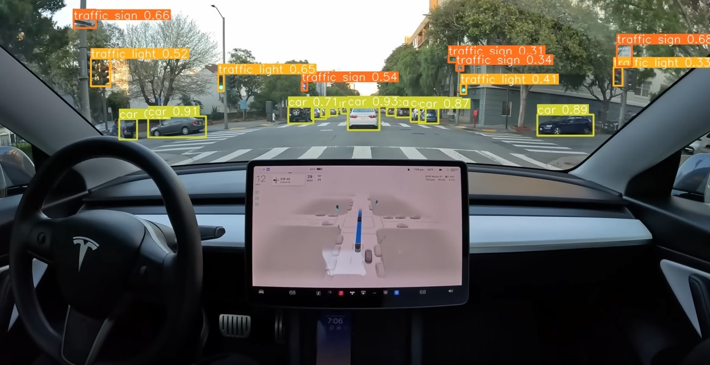

# Road-Object-Detection-and-distance-estimation-using-depth-monocular-model

Accurate detection and recognition of road objects, especially small objects, are crucial for autonomous driving. In this article, we have designed two approaches to solve the problem of detecting small road objects and estimating the distance between the detected objects and the vehicle's camera. The first approach is based on object detection without segmentation, where we optimized the YOLOv5s model. The second approach involves object detection with segmentation using the Mask R-CNN model with Detectron2.
Furthermore, we developed two different models for estimating the absolute distance of the detected objects. The first model utilizes the object detection of optimized model along with information from a monocular depth map using MiDaS. The second model is a deep learning instance segmentation model that extracts specific information from the masks of the detected objects and utilizes relative distances generated by MiDaS to estimate the absolute distance (m).

## Here is the link of our work wich is published in an international Visual Computing Magazine:
link: https://perso.usthb.dz/~slarabi/pdf2/Visual%20Computing3_7.pdf
